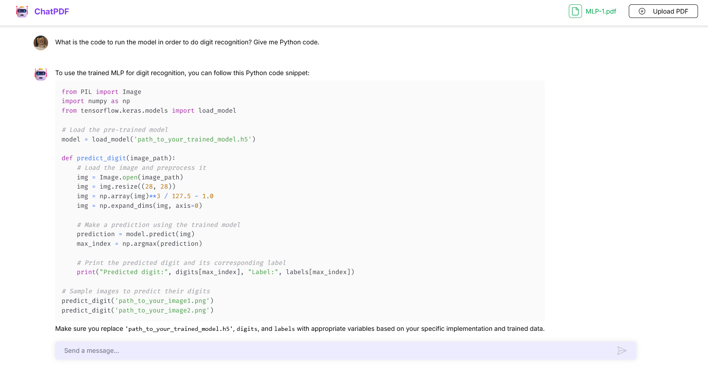

## Try it Out!

https://ai-planet-chatbot.vercel.app

NOTE: Running the server locally gives much better response times, the remote deployment runs on bare minimum hardware and processing times are longer.

**New!** The bot now supports code generation and prompts.

## Project Overview
- A FastAPI application that manages PDF uploads, processes them into vector stores, and uses Ollama’s local LLM for question answering.  
- Multiple deployment options: local (with Python and external Ollama container) or fully Dockerized via Docker Compose.

**The backend is hosted on a GCP server.**

## Key Components  
- **FastAPI Endpoints**  
  - `/api/upload_pdf/`: Uploads and processes PDFs  
  - `/api/ask_question/`: Queries stored document data using Ollama  
- **Chroma Vector Store**: Stores PDF content embeddings for document retrieval.  
- **Ollama LLM**: Provides local inference for question answering via a separate container.  
- **Database (SQLite)**: Maps users to vector store directories, along with saving file paths and timestamps.

## Code Architecture  
1. **Startup**  
   - `main.py` acts as entry point, configuring middleware, logging, database, API routes, and core logic (LLM setup, vector store connection).  
2. **PDF Processing**  
   - Documents split into smaller chunks via **`RecursiveCharacterTextSplitter`** and stored in a Chroma vector store.  
   - Provides an polling endpoint that provides live file processing updates.
3. **Retriever / DB**  
   - SQLite stores file paths and Chroma paths. Queries are handled by a retriever object.  
   - FastAPI **`BackgroundWorker`**  
4. **LLM Integration**  
   - OllamaLLM used with a prompt template and optional conversation memory.  
   - Docker Compose sets up an Ollama container that listens on port 11434.  
5. **Endpoints**  
   - **Upload**: Saves file, creates vector store.  
   - **Ask**: Retrieves relevant documents, runs LLM Q&A chain.  

## File Summaries
- **`README.md`**: Explains usage, prerequisites, project structure, local and Docker-based runs.  
- **`.gitignore`**: Excludes caches, compiled files, logs, and environment directories from version control.  

Sets up a Python 3.12 FastAPI environment. Exposes port 8000 for the API.  
- **`docker-compose.yml`**: Defines two services (ollama, fastapi) and shared volumes for model storage.  
- **`requirements_min.txt`**: Minimal dependencies for the Python environment.  
- **`requirements.txt`**: Complete dependency list for the Python environment (supports advanced features).  
- **`main.py`**: Default FastAPI app. Implements PDF chunking with concurrency, vector store creation, and Q&A endpoints using Ollama LLM.  

Complete setup instructions can be found in **[setup.md](setup.md)**.

## Observations and Shortcomings

- Also tried implementing a **`Celery`** worker for moving chunking to the background but was faced with issues. 
